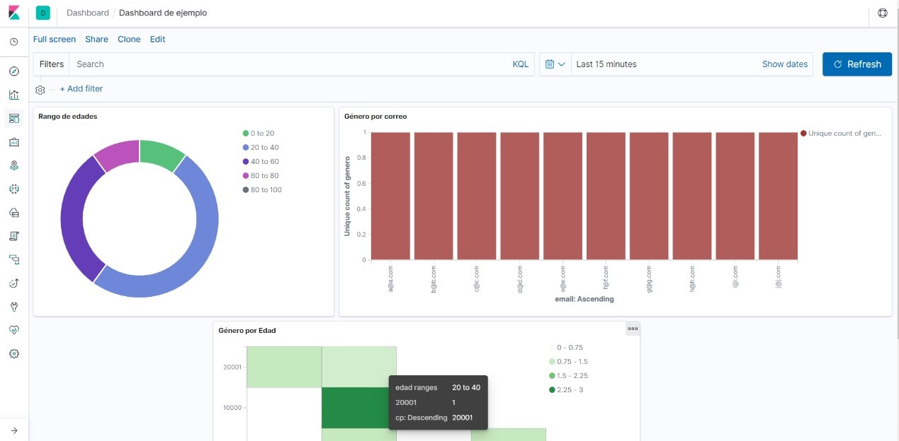

# kibana-dashboard
Ejemplo de cómo implementar Kibana en Docker por medio de un docker-compose.

# Descripción
En este ejemplo, usamos un JSON de ejemplo (`kibana.json`) que contiene:
- mac
- email
- edad
- cp
- genero

Se tomo como ejemplo el json de `shakespeare.json`

# docker-compose
Aquí encontramos los dos elementos para correr Kibana, una BD y el software propio.

Ambas son soluciones de una misma empresa.

Para poder correr el programa, es necesario tener instalado Docker y los puertos mapeados a `localhost`.

De forma que al usar el comando `docker-compose up`, empezarán a funcionar los contenedores (y a descargarse, si es que no están instalados).

A continuación, está un ejemplo de un dashboard en Kibana despues de añadir visores y el json de ejemplo

# Notas:
- Dentro de `docker-compose.yml` está la referencia de donde se obtuvo el archivo.
- Para obtener las gráficos se siguió el tutorial básico de Kibana:
  - [url](https://www.elastic.co/guide/en/kibana/7.6/tutorial-build-dashboard.html)